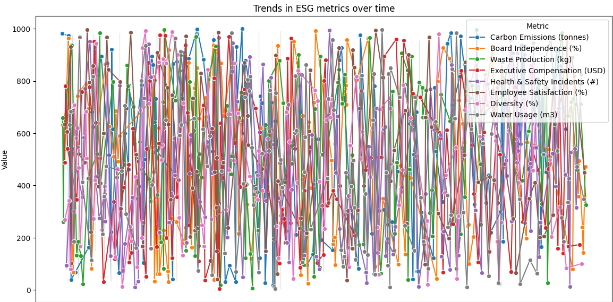

# ESG Data Analysis Project

## Description

This project analyzes ESG (Environmental, Social, Governance) data for a single company. It includes data preprocessing, in-depth analysis, and visualization of results through explanatory charts.



## Installation

### 1. Clone the Repository

Start by cloning the repository to your local machine and navigating to the project directory:

```bash
git clone <https://github.com/omaruus99/ESG_Analysis>
cd ESG_analysis
```

### 2. Install Dependencies
Make sure you have pip installed. Then, install the dependencies by running:
```bash
pip install -r requirements.txt
```

## Usage
1. Data Preprocessing
To run the data preprocessing script and transform the raw data:

```bash
python src/data_preprocessing.py
```
This will read the data files from data/raw/ and generate cleaned files in data/processed/.

2. Data Analysis
To analyze the processed data, use:

```bash
python src/data_analysis.py
```
3. Data Visualization
To generate visualizations from the analyzed data, execute:

```bash
python src/data_visualization.py
```
The charts will be displayed or saved in a specific folder.

## Running Tests
To verify the integrity of the code, particularly data preprocessing, you can run unit tests with pytest:

```bash
pytest tests/test_data_preprocessing.py
```